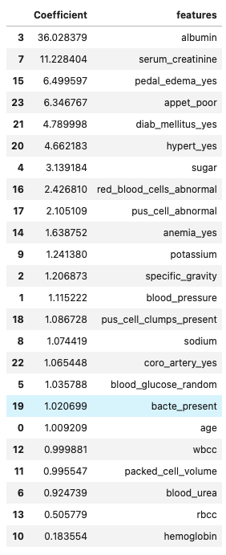
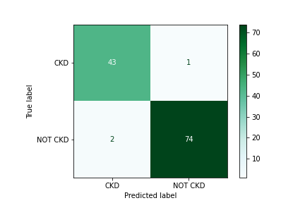
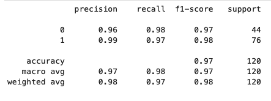

<!---
Questions? Comments?:
1. Log an issue to this repo to alert us of a problem.
2. Suggest an edit yourself by forking this repo, making edits, and submitting a pull request with your changes back to our master branch.
3. Reach out to the data team on Slack and share your thoughts!
--->

# Classification Model Evaluation

- This project uses a chronic kidney disease dataset. You may find [this article](./chronic_kidney_disease.pdf) informative background reading. 
---

#### Project Goal
**Data science problem:** Develop a medical diagnosis test that reduces both the number of false positives and the number of false negatives.

## Repository Resources

| Topic | Description | Link |
| --- | --- | --- |
| Notebook |  Classification Model Evaluation Jupyter Notebook | [Link](./starter-code.ipynb)|
| Data | A set of chronic kidney disease (CKD) data and other biological factors | [Link](./chronic_kidney_disease_full.csv)|
|      | Data Dictionary | [Link](./chronic_kidney_disease_header.txt)|
| Article | Background article on modeling CKD| [Link](./chronic_kidney_disease.pdf) |

---

## Skills Displayed

- Perform statistical analysis in Pandas
- Identify and explain common classification metrics
- Implement and explain logistic regression models

## Coefficient Interpretations

- As serum creatinine increases by one unit (mgs/dl), an individual is 11.65 times as likely to have CKD, all else held equal.  
- If someone's appetite is poor appet_poor, they are 4.57 times as likely to have CKD, all else held equal.  
- If someone's pedal_edema is positive, they are 5.4 times as likely to have CKD, all else held equal.  
- If someone's hypertension or diabetes mellitus is positive, they are about 4 times as likely to have CKD, all else held equal.

## Model Evaluation

## Conclusions

Present this model to doctors or administrators at the hospital and show how the model results in reduced false positives/false negatives. Next steps would be to find a way to roll this model and its conclusions out across the hospital so that the outcomes of patients with CKD (and without CKD!) can be improved!

> - Try a different method of upsampling minority class
> - Already tried simple imputter but performed worst than imputing with the mean. (Although it's unexpected)